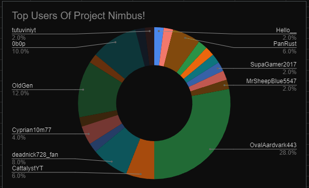

# Project-Nimbus
A simple multi server utility & kitbot for anarchy minecraft servers!
Any issues/concerns with the bot can be reported in the discord: https://discord.gg/M8xVFn73FC

# FAQ
### Where is the code?
> - The project is currently not open sourced due to the people that are gonna steal the code and claim it as theirs.
### Are my coords safe?/logged in any way?
>  - No, your coords are not logged, the data collected or sent to us is listed in the Privacy Policy, you can also tpa to spawn (moooomoooo) and use our kitbot there,
### Why is the bot offline?
>  - The bot may be offline for a period of time as maintenance to code the bot, The bot also may be offline if the account is used somewhere else.
### - How do I check the bots status?
> - Go to our discord server and check the bot "Archive Bot" is online. This correlates to the bot's status on the server.
> 

> 
### - How do I check the github logs?
> - Either check it on github, or join the discord and go to #git-logs.
> - This will give you a notification each time the github gets changed.
> 
>  
### Can I get the kitbot on my server?
> - Yes you can, to do this go to the discord server and message any of the helpers and ask them.
### Our Current Top Users!
> 
### I'm a coder and would like to help the project, how may I help?
> - Currently ProjectNimbus is only being sourced with the owners, applications are not open.
### What you can personally request
> - The Project Nimbus Team values your right to privacy. If you wish to request the following you may create a support ticket in the discord.
> - You may request that your username is completly removed from all databases/logs of the bot (this includes all records so you will no longer be shown on our pie chart)
> - You may request to not be filmed during interviews/meetings regarding Project Nimbus
### Terms Of Service
- Don't try to crash or kick the bot, (anything negative to the bot)
- Don't try to spam the bots kits, that will result in a blacklist.
- Attempting to crack, gain trust of the owners to get the code, or try to modify the code.
> Breaking any of these will result in a blacklist.
# Privacy Policy
Data gathered is showed here.
- All public chat messages and any messages to the bot.
> All messages that the bot can log (above) will be sent to discord though a chat bridge, (meaning I can speak as the bot in discord, and can read any messages sent publicly)
- Players names who leave and join 0b0t.org.
> This is also sent through the chat bridge.
- Usernames and amount of kits you request.
> Used to make a public pie chart of the players and amounts of kits you request.
- Any messages sent through the discord bot, (We might make it public)
### Copyright
> - Project Nimbus is under copyright and any breaking of the TOS without permission may result in legal action. 
> Project Nimbus 2020-2023

